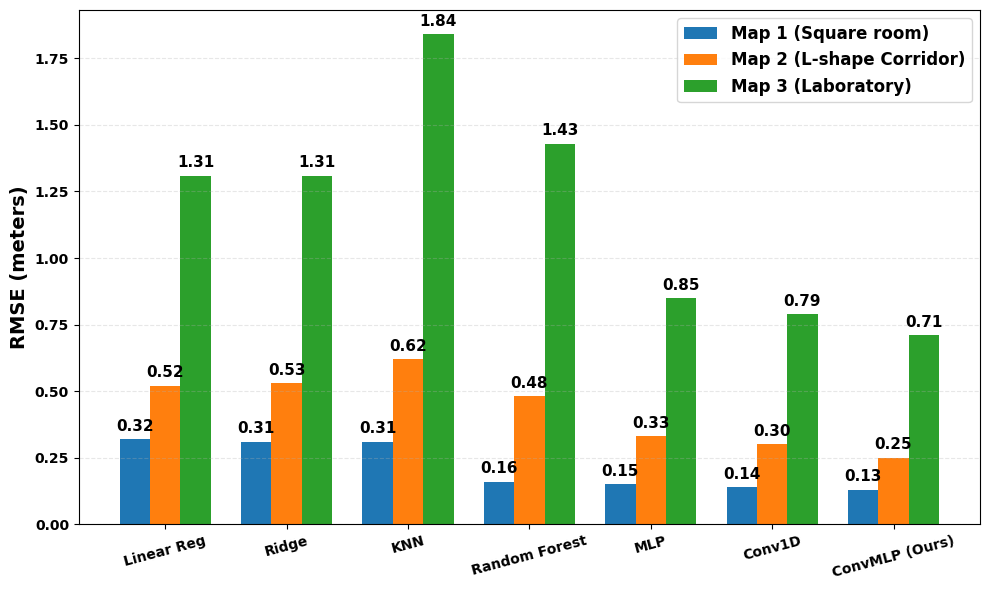
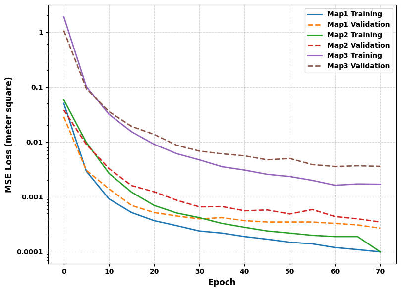
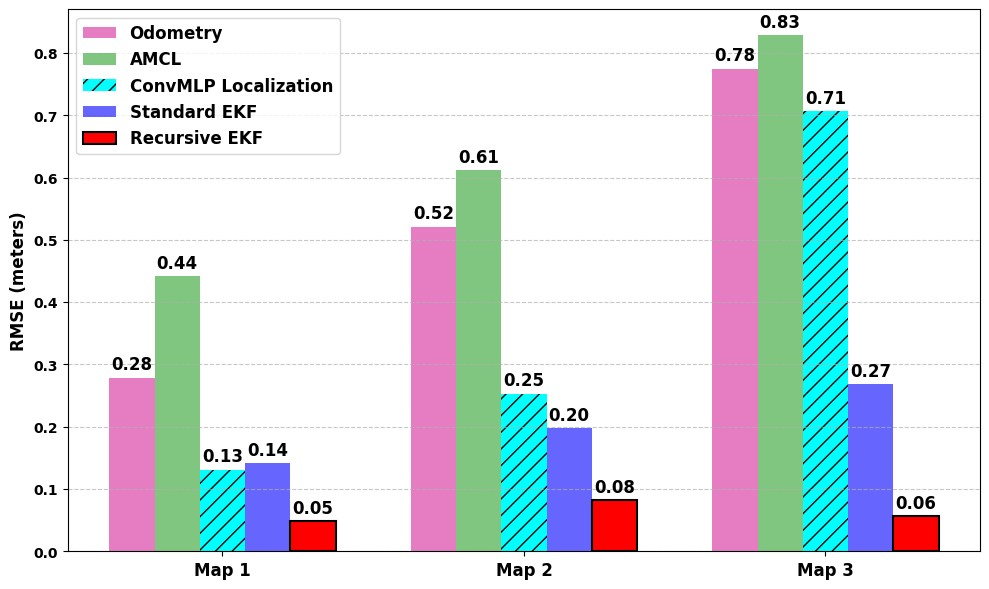

# LiDAR-based-deep-learning-enabled-geometric-fingerprinting-for-indoor-robot-localization-
The method developed combines LiDAR scan range data with 11 handcrafted geometric features to train a Convolutional Multi-Layer Perceptron (ConvMLP) regression model to predict the two-dimensional location of a robot. The predicted pose is further smoothed by using a proposed novel recursive Extended Kalman filter (EKF). 


# 📌 Overview
This repository provides a complete, reproducible pipeline for LiDAR‑based indoor localization using:
- 360‑beam 2D LiDAR scans
- 11 handcrafted geometric features
- A lightweight ConvMLP neural network
- Real‑time ROS2 inference (~280 Hz, 3.5 ms latency)
- Comparison against different ML and DL models and other localization techniques such as AMCL, Cartographer SLAM, and Odometry

The pipeline covers data collection → preprocessing → model training → inference.

```md
📂 Directory Structure
ConvMLP_LiDAR_Code/
│
├── scripts/                     # All Python scripts
│   ├── teleop_with_trigger.py
│   ├── fingerprint_collector_live.py
│   ├── preprocess.py
│   ├── train_model.py
│   ├── localization_inference_Map1.py
│   ├── localization_inference_Map2.py
│   ├── localization_inference_Map3.py
│   └── trajectory_extractor_AMCL.py
│
├── dataset/
│   ├── raw/                     # Raw CSVs collected in Phase 1
│   └── processed/               # Preprocessed .npy files (Phase 2 output)
│
├── models/                      # Trained ConvMLP model weights (.pt)
│
├── ros2bags/                    # Optional ROS2 bag files
│
└── commands_to_run_pipeline.txt 

```


# 🗺️ Experimental Environments

<p align="center">

  <span style="display:inline-block; text-align:center; margin: 10px;">
    <b>Map 1</b><br>
    
  </span>
</p>
<p align="center">
  <span style="display:inline-block; text-align:center; margin: 10px;">
    <b>Map 2</b><br>
    
  </span>

</p>


<p align="center">

  <span style="display:inline-block; text-align:center; margin: 10px;">
    <b>Map 3 Real Image</b><br>
    
  </span>
</p>
<p align="center">
  
  <span style="display:inline-block; text-align:center; margin: 10px;">
    <b>Map 3 Rviz Image</b><br>
    
  </span>
</p>


# 🚀 How to Run the Full Pipeline
This section explains how to run each phase.
For exact commands, refer to:
ConvMLP_LiDAR_Code/commands_to_run_pipeline.txt

Note that following the above directory structure helps to implement the entire pipeline. 

Note: The Datasets and other ROS bags data can be found here: 

# 📦 Dataset (Mendeley Data)
Full dataset (raw scans, features, CSVs, GT trajectories) is available on Mendeley:
👉 [DOI: 10.17632/8vn4xh7y23.1]

# Video
The video provides a full pipeline demonstration of the ConvMLP and recursive EKF localization, including teleoperation, data collection, preprocessing, model training, and inference.
Video can be viewed here: 👉 [https://youtu.be/qfRTmf15PfY]

# Phase 1 — Data Collection
1. Connect to TurtleBot3
```
ssh turtlebot3@<robot_ip>
ros2 launch turtlebot3_bringup robot.launch.py
```


# 2. Teleoperate the robot
```
python3 teleop_with_trigger.py
```

Controls:
- w/x → forward/backward
- a/d → left/right
- s → stop
- r → auto‑rotate (36 steps × 10°)


<p align="center">

  <span style="display:inline-block; text-align:center; margin: 10px;">
    <b></b><br>
    
  </span>
</p>


  
# 3. Collect LiDAR + Pose Data
```
python3 fingerprint_collector_live.py
```

This script automatically logs:
- 360‑beam LiDAR scan
- 11 geometric features
- SLAM pose reference
- Saves everything into a CSV file inside:
dataset/raw/

<p align="center">

  <span style="display:inline-block; text-align:center; margin: 10px;">
    <b></b><br>
    
  </span>
</p>

<p align="center">

  <span style="display:inline-block; text-align:center; margin: 10px;">
    <b></b><br>
    
  </span>
</p>

<p align="center">

  <span style="display:inline-block; text-align:center; margin: 10px;">
    <b></b><br>
    
  </span>
</p>


# 4. Run Cartographer SLAM (for GT pose)
In separate terminals:
```
ros2 launch turtlebot3_cartographer cartographer.launch.py use_sim_time:=true
ros2 bag record -o map1__collection_run /scan /odom /tf /tf_static /imu /cmd_vel
ros2 run nav2_map_server map_saver_cli -f ~/L_map
```


# Phase 2 — Preprocessing

Run preprocessing (cleaning + augmentation):
```
python3 scripts/preprocess.py
```

Output is saved to:
dataset/processed/your_processed.npy


# Phase 3 — Model Training
Train the ConvMLP model:
```
python3 scripts/train_model.py
```
Note: The above script contains the model fitting with other ML models like Linear Regression, Ridge Regression, KNN, Random Forest, MLP, Conv1D, and ConvMLP 


Model weights are saved to:
models/model_xxx.pt


# Phase 4 — Inference (Real‑Time Localization)
Run inference:
```
python3 scripts/localization_inference.py
```

Requirements:
- Trained model in models/
- Processed dataset in dataset/processed/ (if needed)
This script publishes ML pose estimates and logs metrics.

# AMCL Comparison (Optional)
Replay rosbag:
```
ros2 bag play map1_path2_inference_Lhome__collection_run --rate 1.0
```
Extract trajectory:
```
python3 scripts/trajectory_extractor_AMCL.py \
  --ros-args -p out_csv:=csv/map2_compare.csv -p ml_topic:=/ml_pose
```
Run AMCL:
```
ros2 launch nav2_bringup localization_launch.py map:=/home/robo2/L_map.yaml autostart:=True
```
Initialize pose:
```
ros2 topic pub --once /initialpose geometry_msgs/msg/PoseWithCovarianceStamped "{...}"
```
Run ML inference:
```
python3 scripts/localization_inference.py
```


# 📊 Performance Summary
<p align="center">

  <span style="display:inline-block; text-align:center; margin: 10px;">
    <b>Localization accuracy comparisons between traditional and deep learning models</b><br>
    
  </span>
</p>

<p align="center">

  <span style="display:inline-block; text-align:center; margin: 10px;">
    <b>Training and Validation loss curves of ConvMLP models for three maps</b><br>
    
  </span>
</p>
<p align="center">

  <span style="display:inline-block; text-align:center; margin: 10px;">
    <b>Performance of different localization methods across maps (MAP 1: Path 1, MAP 2: Path 2, MAP 3: Path 3)</b><br>
    
  </span>
</p>

# Inference Trajectories Results on all three maps
<p align="center">

  <span style="display:inline-block; text-align:center; margin: 10px;">
    <b></b><br>
    
  </span>
</p>

<p align="center">

  <span style="display:inline-block; text-align:center; margin: 10px;">
    <b></b><br>
    
  </span>
</p>
<p align="center">

  <span style="display:inline-block; text-align:center; margin: 10px;">
    <b></b><br>
    
  </span>
</p>

# 🧠 Citation
(Currently under review in EAAI Journal)

# 🙌 Acknowledgements
This work was carried out under the guidance of **Prof. <Dr. Shayok Mukhopadhyay>**, [https://sites.google.com/site/shayok/Home]  
Robotics Lab, University of New Haven.


