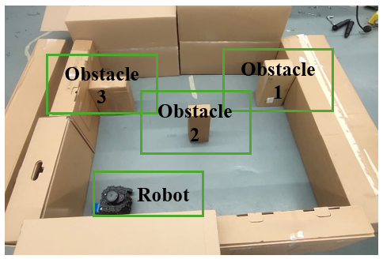
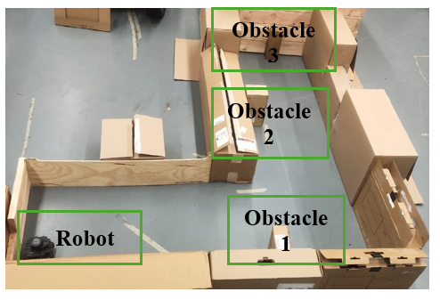
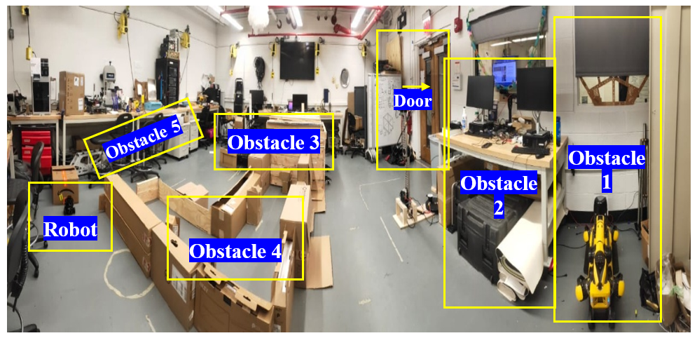
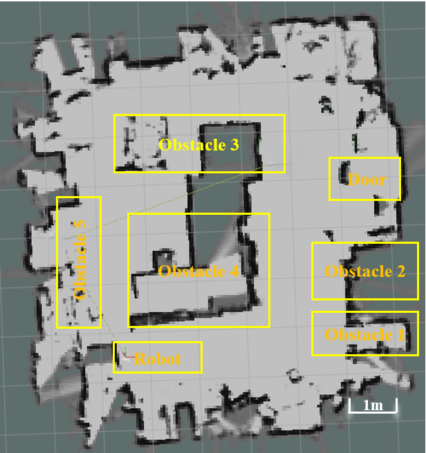

# LiDAR-based-deep-learning-enabled-geometric-fingerprinting-for-indoor-robot-localization-
The method developed combines LiDAR scan range data along with proposed eleven handcrafted geometric features to train a Convolutional Multi-Layer Perceptron (ConvMLP) regression model, for predicting the two-dimensional location of a robot. The predicted pose is further smoothed by using a proposed novel recursive Extended Kalman filter (EKF). 

📌 Overview
This repository provides a complete, reproducible pipeline for LiDAR‑based indoor localization using:
- 360‑beam 2D LiDAR scans
- 11 handcrafted geometric features
- A lightweight ConvMLP neural network
- Real‑time ROS2 inference (~280 Hz, 3.5 ms latency)
- Comparison against AMCL, Cartographer SLAM, and Odometry
The pipeline covers data collection → preprocessing → model training → inference.

📂 Directory Structure
ConvMLP_LiDAR_Code/
│
├── scripts/                     # All Python scripts
│   ├── teleop_with_trigger.py
│   ├── fingerprint_collector_live.py
│   ├── preprocess.py
│   ├── train_model.py
│   ├── localization_inference_Map1.py
│   ├── localization_inference_Map2.py
│   ├── localization_inference_Map3.py
│   └── trajectory_extractor_AMCL.py
│
├── dataset/
│   ├── raw/                     # Raw CSVs collected in Phase 1
│   └── processed/               # Preprocessed .npy files (Phase 2 output)
│
├── models/                      # Trained ConvMLP model weights (.pt)
│
├── ros2bags/                    # Optional ROS2 bag files
│
└── commands_to_run_pipeline.txt # Command reference for all phases

🗺️ Experimental Environments

  ### Map1
  
  ### Map2
  

  ### Map3 Real Image
  
  ### Map3 Rviz Image
  

🚀 How to Run the Full Pipeline
This section explains how to run each phase.
For exact commands, refer to:
ConvMLP_LiDAR_Code/commands_to_run_pipeline.txt

Phase 1 — Data Collection
1. Connect to TurtleBot3
ssh turtlebot3@<robot_ip>
ros2 launch turtlebot3_bringup robot.launch.py

2. Teleoperate the robot
python3 teleop_with_trigger.py

Controls:
- w/x → forward/backward
- a/d → left/right
- s → stop
- r → auto‑rotate (36 steps × 10°)
3. Collect LiDAR + Pose Data
python3 fingerprint_collector_live.py

This script automatically logs:
- 360‑beam LiDAR scan
- 11 geometric features
- SLAM pose reference
- Saves everything into a CSV file inside:
dataset/raw/

4. Run Cartographer SLAM (for GT pose)
In separate terminals:
ros2 launch turtlebot3_cartographer cartographer.launch.py use_sim_time:=true
ros2 bag record -o map1__collection_run /scan /odom /tf /tf_static /imu /cmd_vel
ros2 run nav2_map_server map_saver_cli -f ~/L_map



Phase 2 — Preprocessing
Run preprocessing (cleaning + augmentation):
python3 scripts/preprocess.py

Output is saved to:
dataset/processed/your_processed.npy

Phase 3 — Model Training
Train the ConvMLP model:
python3 scripts/train_model.py

Model weights are saved to:
models/model_xxx.pt

Phase 4 — Inference (Real‑Time Localization)
Run inference:
python3 scripts/localization_inference.py

Requirements:
- Trained model in models/
- Processed dataset in dataset/processed/ (if needed)
This script publishes ML pose estimates and logs metrics.

AMCL Comparison (Optional)
Replay rosbag:
ros2 bag play map1_path2_inference_Lhome__collection_run --rate 1.0


Extract trajectory:
python3 scripts/trajectory_extractor_AMCL.py \
  --ros-args -p out_csv:=csv/map2_compare.csv -p ml_topic:=/ml_pose


Run AMCL:
ros2 launch nav2_bringup localization_launch.py map:=/home/robo2/L_map.yaml autostart:=True


Initialize pose:
ros2 topic pub --once /initialpose geometry_msgs/msg/PoseWithCovarianceStamped "{...}"


Run ML inference:
python3 scripts/localization_inference.py

📊 Performance Summary
|  |  |  |  | 
|  |  |  |  | 
|  |  |  |  | 
|  |  |  |  | 
|  |  |  |  | 

📦 Dataset (Mendeley Data)
Full dataset (raw scans, features, CSVs, GT trajectories) is available on Mendeley:
👉 [Insert your Mendeley link here]

🧠 Citation
(Add your BibTeX once the paper is accepted.)

🙌 Acknowledgements
- University of New Haven Robotics Lab
- Open‑source ROS2 community

⭐ What I can help you with next
I can generate:
- A GIF storyboard (what each GIF should show)
- A professional GitHub project description (the sidebar text)
- A LICENSE file
- A clean badge section (Python version, ROS2 version, etc.)
- A CONTRIBUTING.md if you want to make it open‑source friendly
